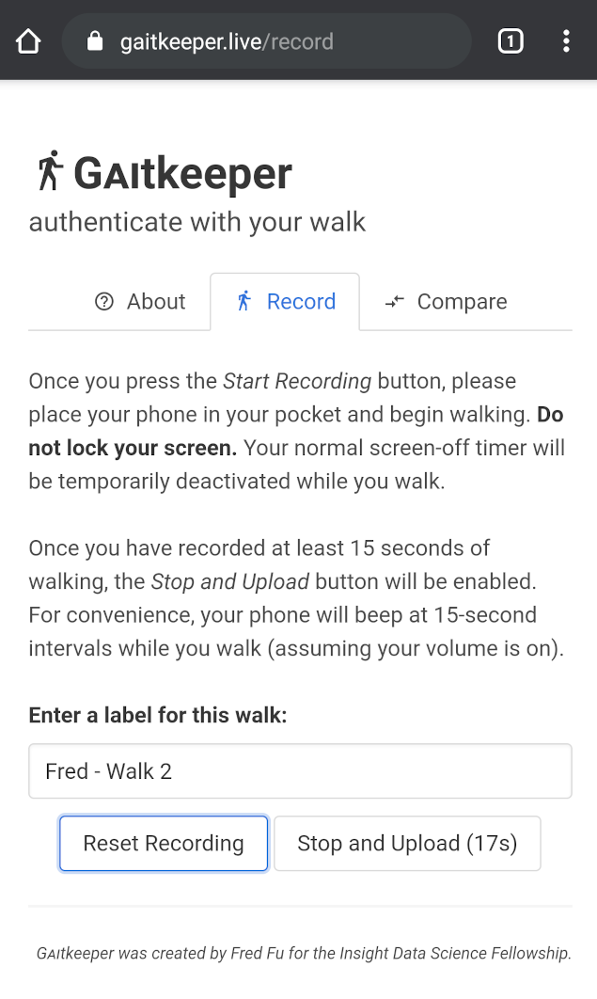
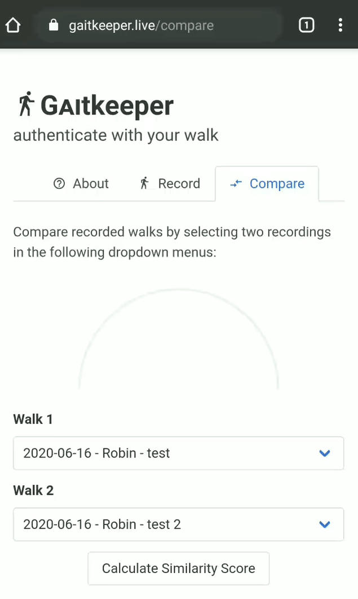

# [Gᴀɪtkeeper](https://gaitkeeper.live): *authenticate with your walk*

This project is a gait-based biometric authentication proof-of-concept with the goal authenticating call center customers using characteristics of their gait or walking pattern. It allows users to record their walks using measurements from ubiquitous smartphone motion sensors (accelerometer and gyroscope) and allows agents to compare these recordings against a reference to verify a customer's identity using a machine learning model. You can access the demo at https://gaitkeeper.live.

Gᴀɪtkeeper was developed in a three-week period as part of [Insight Data Science](https://www.insightdatascience.com/). The original IDNet reference dataset used to bootstrap the initial model is available [here](http://signet.dei.unipd.it/research/human-sensing/).

## Screenshots

  
  

